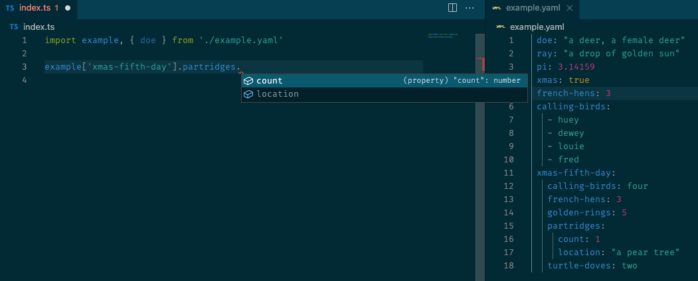

<h1 align='center'>
<p align='center'>typescript-plugin-yaml</p>
</h1>

<p align='center'>
<a href='https://www.npmjs.com/package/typescript-plugin-yaml'>

</a>
<a href='https://npmjs.com/package/typescript-plugin-yaml'>

</a>
</p>
<p align='center'>A Typescript Language Service plugin for YAML.</p>
<p align='center'>
 
</p>


## Usage

```shell
# With PNPM
pnpm add typescript-plugin-yaml -D

# With Yarn
yarn add -D typescript-plugin-yaml
```

And then add this to `tsconfig.json`.
```json
{
  "compilerOptions": {
    "plugins": [{ "name": "typescript-plugin-yaml" }]
  }
}
```
To use this plugin with Visual Studio Code, you should set your workspace's version of TypeScript, which will load plugins from your `tsconfig.json` file. see: [Using the workspace version of TypeScript](https://code.visualstudio.com/docs/typescript/typescript-compiling#_using-the-workspace-version-of-typescript).


## Debugging

You can view TS Server log by enter `Typescript: Open TS Server log` in [Command Palette](https://code.visualstudio.com/docs/getstarted/userinterface#_command-palette).

## About

This plugin was inspired by [typescript-plugin-css-modules](https://github.com/mrmckeb/typescript-plugin-css-modules) and borrows heavily from its approach. Thanks for this awesome project.
